## Introduction ##

```{r, setup}
library("knitr")
library("plyr")
library("dplyr")
library("reshape2")
library("caret")
library("treelapse")
opts_chunk$set(fig.width = 10, fig.height = 7, cache = TRUE)
```

```{r, read-chunks}
read_chunk("~/Documents/programming/treelapse/inst/doc/bikesharing_code.R")
```
This vignette applies the `treelapse` package to explore data on bikesharing.
Bikesharing lets people use bikes temporarily between different stations, Figure
\@ref(fig:bike_picture) shows an example station.

```{r, bike_picture, fig.caption="Bikesharing in London, from https://commons.wikimedia.org/wiki/File:Bikesharing_londonIMG_1022.jpg.", out.width = "400px"}
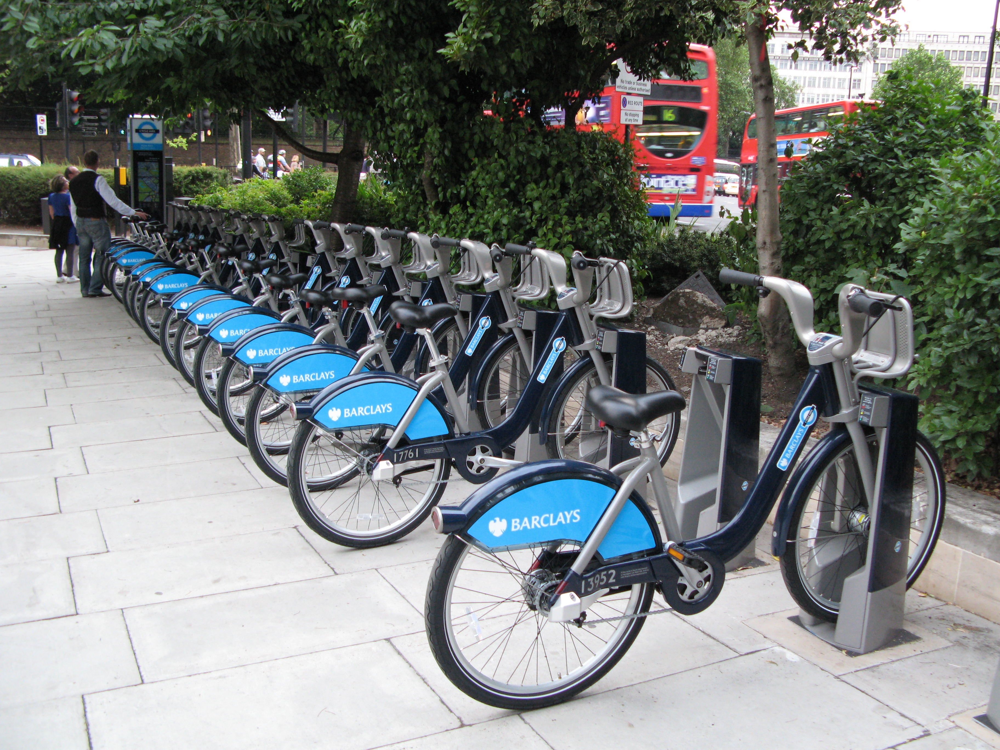
```

The main questions of interest from an operational point of view are forecasting
demand across bike rack locations and planning the locations for new ones. We
will build some visualizations to help with this first forecasting problem. Our
data don't include a spatial component, but if it were available, the figures
we produce here could be extended to cover this case. We downloaded it from
[UCI](archive.ics.uci.edu/ml/datasets/Bike+Sharing+Dataset); it had been
featured in a kaggle
[competition](https://www.kaggle.com/c/bike-sharing-demand) before.

The data look like this -- `casual`, `registered`, and `cnt` are measures of
bike demand, the other columns are potentially explanatory features. We've
removed a few days that have a lot of missing data for some reason.

```{r, data}
```

The originaly competition was about forecasting demand on an hour-by-hour
basis[^ Interestingly, you are allowed to use the explanatory variables from the
future to make these predictions, so it's not strictly forecasting, per se.].
We will consider a related but slightly different problem, to make it more
interesting from a visualization point of view: what are the different shapes of
bicycle demand during a 24 hour period, and how to the different explanatory
variables associate with different shapes? E.g., how hot does it have to be
for people to give up on bikeshares in the day (and, does nighttime demand
increase)?

Framing the problem this way lets us use `treelapse`: we want to study a
collection of potentially related time series. Each time series is the demand
curve for a single day, and certain time series may be more related to each
other based on the similarity of their explanatory variables. We go into detail
about our approach below.

## Approach ##

That we have many related time series is now clear, but how to arrange them in a
tree is not obvious. The approach we use here is to build a classification tree
using the explanatory variables, calling series close to each other if they lie
in the same leaf node[^This is similar to using "proximity" plots from random
forests, but is more directly interpretable.]. There are probably other natural
ways to create this sort of
structure[^write to [me](mailto:kriss1@stanford.edu) if you have ideas], but
we'll go with what we have.

In more detail, we will calculate a single number summary of each daily demand
series and then train a CART model to that based on the explanatory variables
for that day. Each time series is associated with some leaf node in this
regression tree, based on its explanatory variables, and all the series at the
same leaf node will hopefully have similar values of the response statistic.
We can then use timebox trees and treeboxes. The statistic we will use is bike
demand at 8AM. We found this more interesting than the (perhaps more natural)
"total daily demand" statistic, because it clearly distinguishes between weekday
and weekend use.

For a slight variation, we can assign each series to a bin according to its
value of this statistic. We can then see which parts of the tree are home to
which of the bin types using the sankey representation.

## Predictions ##

This section carries out the plan sketched above. First, we featurize the
original data at the daily level -- these will be input to the classification
model.

```{r, featurize}
```

Now we can train our model. We intentionally use a tuning parameter that will
give a larger tree, since this the display later on more interesting.

```{r, train-model}
```

It's a little bit of work to extract the edgelist from the trained tree. First,
there are only functions for extracting paths from trees, not edges. This is
analogous to only having taxonomic tables, rather than edges in the taxonomic
tree. Second, these paths only lead down to leaf nodes, not actual observed data
series. So, we will have to manually add edges between leaf nodes and the series
that are contained in them.

All this said, it's only a few lines to get the required code.

```{r, get-tree-paths}
```

From these paths, we can build an edgelist using `taxa_edgelist`. Then, we
add the edges from decision tree leaves to the samples assigned to them. Note
that the edgelist names can't just be integers -- this is a bug that should be
resolved in a future version of the package.

```{r, build-edgelist}
```

We are only missing one more piece in order to apply treelapse: We don't have
series associated with internal nodes in the decision tree. We can use our
`tree_means` function to accomplish this, applying it for each hour
individually. This will associate each internal node with the average of all
sample series (the leaves in our full, extended CART tree) that are its
descendants.

```{r, time-values}
```

## Visualization ##

Finally, we can produce the time and treebox visualizations.

```{r, timeboxes}
```


```{r, treeboxes}
```

Also, we can generate the sankey representation getting quantiles of demand at
8AM and counting, for each decision tree node, the number of descendant series
falling into each bin. This gives us a general sense of which parts of the tree
help to classify series into "low", "middle", to "high" demand series.

The code we use to generate these bin counts at internal nodes is similar to
that we used to get per-timepoint averages before (it probably could be
modularized).

```{r, get-group-values}
```

This can be directly input to the DOI sankey.

```{r, doi-sankey}
```

## Interpretation ##

The visualizations above should be more or less self-explanatory, but we include
some example views just to get you thinking about some example workflows. We'll
isolate the timebox, treebox, and DOI Sankey views, even though in practice it
can be helpful to complement observations from one display using one of the
others.

### Timeboxes ###

The first thing that is clear is that there are two usage regimes -- weekend and
weekday, with weekday showing two peaks around rush hour and weekend having one
big peak centered around the middle of the day. We can draw a few boxes to
highlight just these series on their own.

These three boxes highlight mostly weekday series.

```{r working-fig, out.width = "400px"}
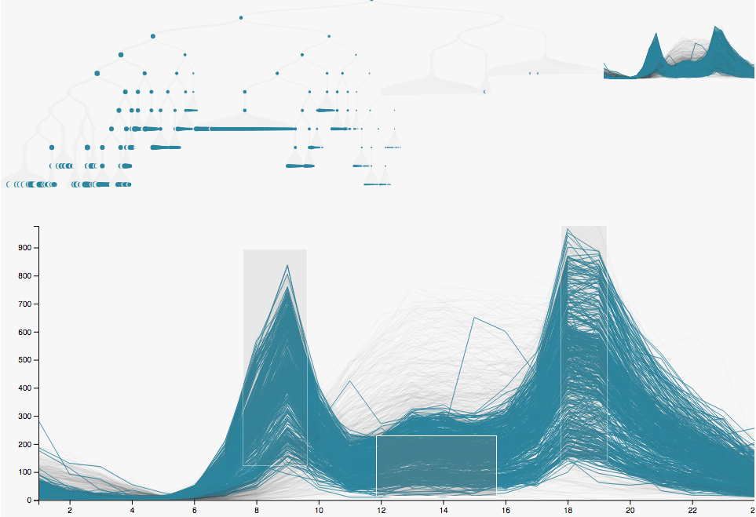
```

And these highlight the weekend series.

```{r weekend-fig, out.width = "400px"}
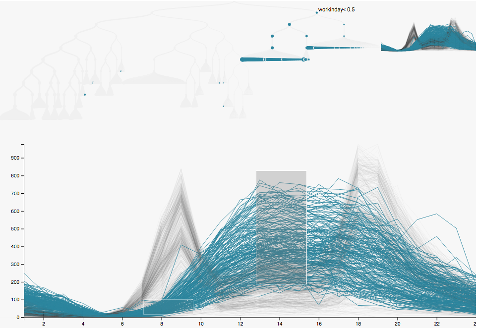
```

Note that at each split in the tree, we place the series with higher mean on the
left. Consider our choice of $y$ (demand at 8AM), it's not so surprising that the
top split is whether the day is a working day or not. The fact that the working
day split is on the left means that, on average (across samples and hours) the
working days have higher demand than the weekends. This is not obvious from the
series on their own; it's unclear just by looking at the series whether the
weekend midday peak is enough to offset the weekday rush hour peaks. But the
tree settles this question.

The next thing we might notice is that the difference between weekends with high
demand and those with low demand is mainly the apparent temperature. This is the
story from the next two figures. We just dragged the box over the midday peak up
and down (keeping the low rush-hour boxes to ensure we were in weekend series)
and then hovered over the highlighted nodes in the tree.

```{r weekend-warm-fig, out.width = "400px"}
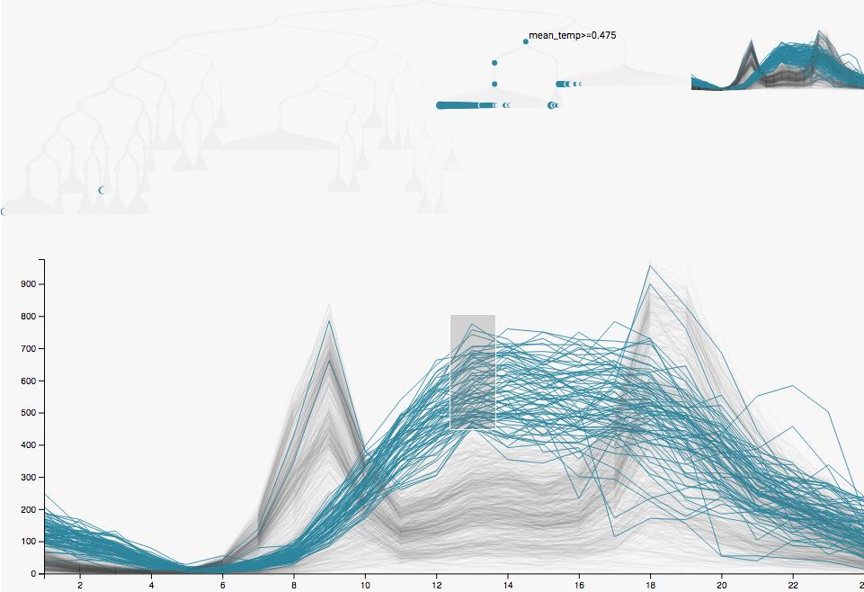
```

```{r weekend-cold-fig, out.width = "400px"}
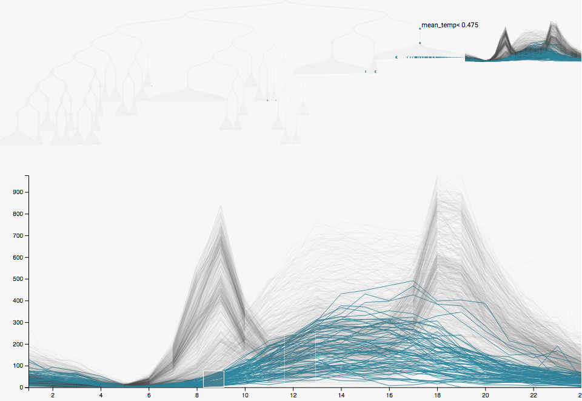
```

Another major source of variation in these series seems to be whether the
measurement was taken during 2011 or 2012. The demand generally seems higher
in 2012, especially for weekday commutes. In addition to hovering over the
tree, we can search for specific nodes and highlight their series using the
search box. Here we have searched for the average series for

* weekends: This is the unimodal red curve.
* working days: This is the central bimodal red curve.
* working days in 2011: This is the lower bimodal red curve.
* working days in 2012: This is the upper bimodal red curve.

This is the point of the next two figures. The only difference between them
is the set of series that are being brushed over. In the first, we brush over
the very high valued series, these appear on the top left of the tree,
according to the splitting procedure described before. Apparently, these are
almost always in 2012 (they are descendants of the 2012 red node) and are
usually on warm days. In the second, we brush over the slightly lower demand
series. This includes almost all of the 2011 series (middle red node), but also
a reasonable number of the winter (season < 1.5) 2012 series. So, we get a sense
of both a trend of overall increasing demand as well as strong seasonal
influence.

```{r working-high-fig, out.width = "400px"}
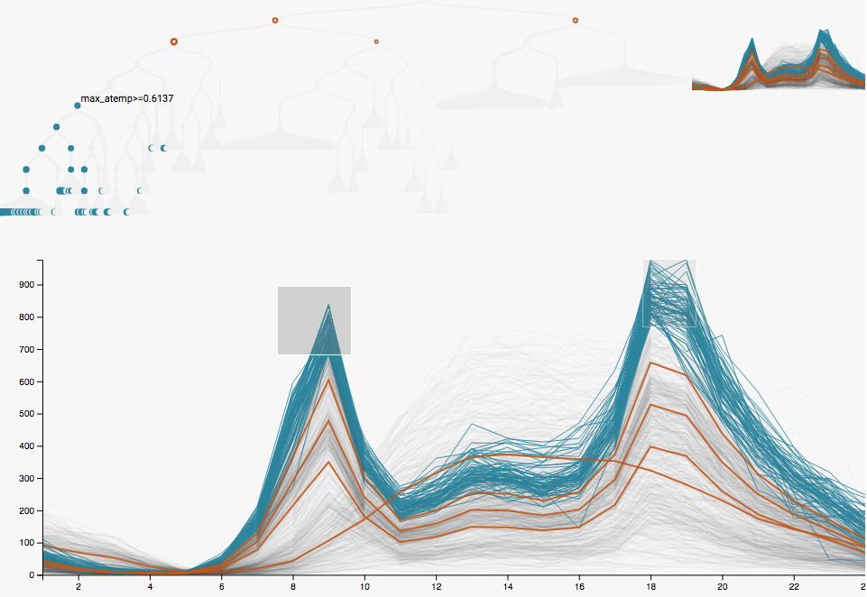
```

```{r working-low-fig, out.width = "400px"}
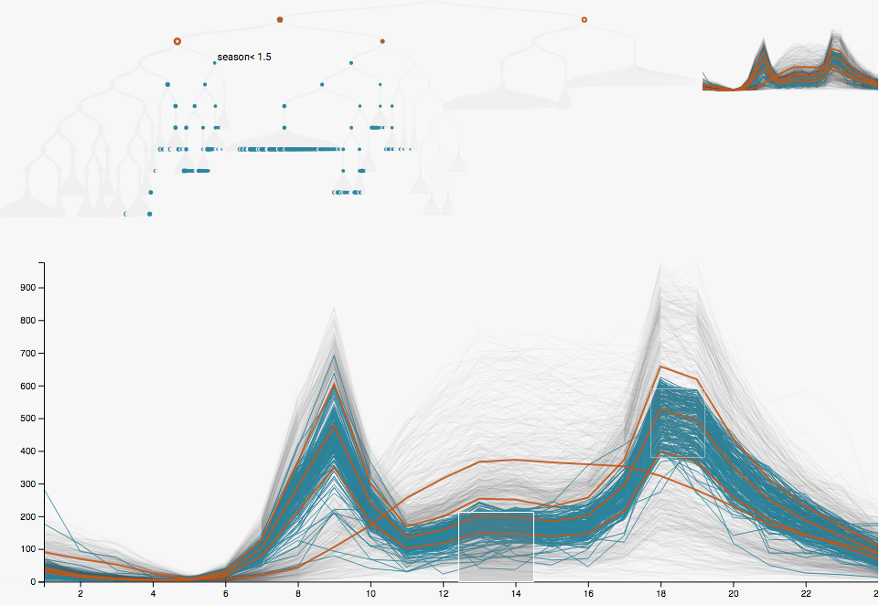
```

In our final timebox view, we use zooming to ask a very specific question: On what
days do people ride bikes very late at night? We use the "visual scent" in
the top right to select the window between 1AM and 7:30AM. We then introduce
a brush to highlight those series for which there is higher demand during
this time window. Then, referencing the tree, we see that these series
usually correspond to warm weekends, which makes a lot of sense (not that
I've ever tried it myself).

```{r nighttime-fig, out.width = "400px"}
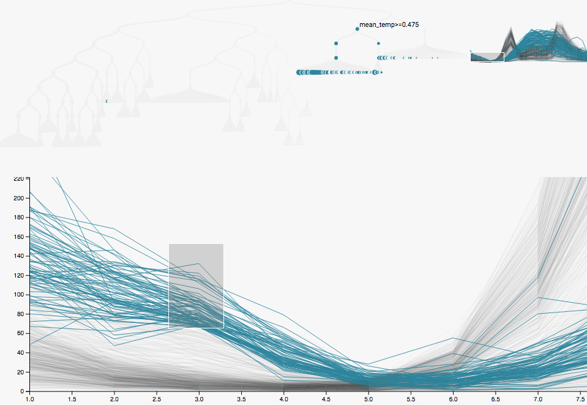
```

### Treeboxes ###


### DOI Sankey ###

The sankey gives some alternative views of the same phenomena. Here, the
colors encode different quantiles of 8AM demand. The colors on
the left are associated with series with low 8AM demand, those on the right are
associated with high 8AM demand. Reinforcing our conclusions from before, the
first split places all of the bottom quintile into the "weekend" branch.

```{r root-doi, out.width = "400px"}
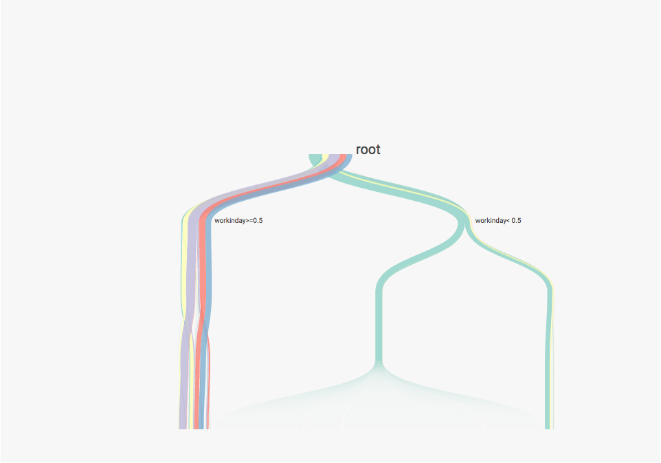
```

Next, we follow the branches associated with the top two quintiles (red and
blue). We can see that the blue (top quintile) has the largest contribution
among the working day, second year, later season series. A reasonable
proportion of the red (second highest quintile) go down this branch too, but
the red also makes up a large part of the earlier season, second year branch.

```{r medium-demand-doi, out.width = "400px"}
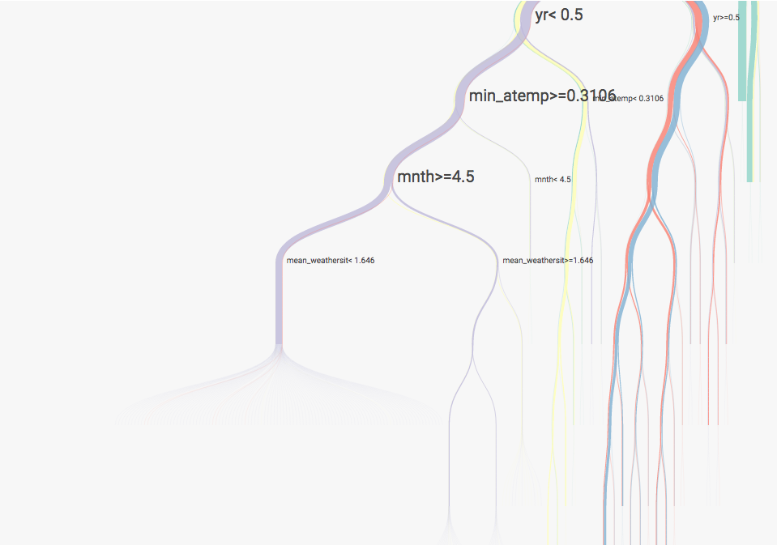
```

If we click to the branches on the left, we see branches that are made mostly
of second and third quintile samples. These are generally associated with
samples from the first year. The main difference between the second and third
quintiles is that the third quintile samples are usually on warmer days.

```{r high-demand-doi, out.width = "400px"}
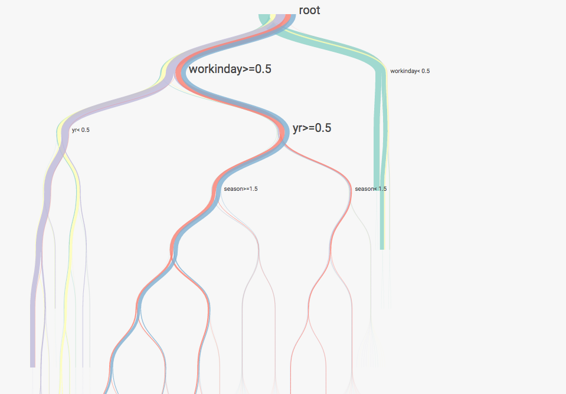
```
